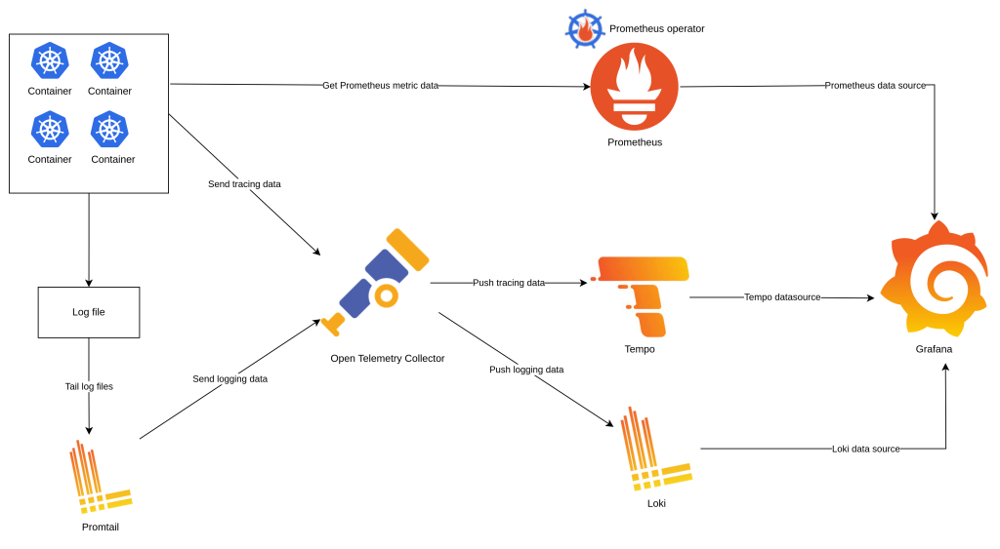

# 📊 Kubernetes Observability

## 🎯 Objective

This project sets up a full **Kubernetes observability stack** using **Prometheus, Loki, Promtail, Tempo, and Grafana**, all provisioned and automated with **Terraform** and **Helm**.

It allows you to:

- 📈 Collect metrics, logs, and traces from Kubernetes clusters and workloads
- 🔎 Visualize everything in Grafana, including pre-built dashboards
- ⚙️ Automate cluster setup and monitoring stack installation with Terraform
- 🧪 Test distributed tracing using a sample **Go application (`tracing-app`)**, deployed separately via `kubectl`

---

## 🧠 Observability Architecture



The illustration outlines the key components of the observability architecture:

- **Prometheus**: Scrapes metrics from Kubernetes and apps
- **Loki + Promtail**: Collects and indexes application logs
- **Tempo**: Stores and visualizes distributed traces
- **Grafana**: Dashboards for logs, metrics, and traces
- **Tracing-App**: A simple Go app (deployed manually) generating logs, metrics, DB calls, and traces

```
Terraform
   │
   ├──► Creates Minikube cluster
   ├──► Installs Prometheus, Loki, Promtail, Tempo, and Grafana via Helm
   └──► Deploys dashboards via ConfigMaps
kubectl
   └──► Applies `tracing-app` Deployment + Service manually
```

---

## ⚙️ Prerequisites

To run this project locally, you need:

- 🧰 `terraform` >= 1.3
- 🐳 Docker or Podman (Minikube driver)
- 📦 `minikube`
- 📐 `kubectl`
- ⛵ `helm`
- 🐹 `go` >= 1.24 (to build the app)

---

## 🚀 How to Run the Project Locally

### 1. 📁 Clone the repository

```bash
git clone https://github.com/pedroschmid/k8s-observability.git
cd k8s-observability
```

### 2. ⚙️ Start and provision the observability stack

```bash
make init
make apply
```

This will:

- Create a local Minikube cluster
- Install Prometheus, Loki, Promtail, Tempo, and Grafana via Helm
- Create ConfigMaps for Grafana dashboards

### 3. 🏗️ Build and load the Go tracing app image

```bash
cd app
podman build -t tracing-app:latest .
minikube image load tracing-app:latest
```

### 4. 🚀 Deploy the tracing app

```bash
kubectl apply -f app/kubernetes/deployment.yaml
kubectl apply -f app/kubernetes/service.yaml
```

### 5. 🔍 Access Grafana

```bash
kubectl port-forward svc/grafana -n monitoring 3000:80
```

Login with:

- **User:** `admin`
- **Password:** `admin`

Pre-built dashboards include:

- **Kubernetes Cluster Overview**
- **Tracing-App Logs & Metrics**
- **Tempo Distributed Traces**

---

## 🧪 Testing the Tracing App

Forward the app service locally:

```bash
kubectl port-forward svc/tracing-app 8080:8080
```

Call the `/search` endpoint to generate metrics, logs, DB queries, and traces:

```bash
curl "http://localhost:8080/search?q=test"
```

In Grafana, open the **Tempo dashboard** and analyze traces.

---

## 🧹 How to Clean Up

```bash
make destroy
kubectl delete -f app/kubernetes/deployment.yaml
kubectl delete -f app/kubernetes/service.yaml
```

---

## 📁 Project Structure

```
.
├── app/                        # Go tracing app (manual deployment)
│   ├── cmd/server              # Main application entrypoint
│   ├── internal/               # Handlers, tracing, database logic
│   ├── kubernetes/             # Deployment + Service manifests
│   └── Dockerfile              # Multi-stage build
├── terraform/                  # Observability stack (Minikube + Helm)
│   ├── helm/grafana/dashboards # Pre-built dashboards
│   ├── helm/*/values.yaml      # Configs for each chart
│   ├── cluster.tf              # Minikube configuration
│   ├── dashboards.tf           # Configmaps of grafana dashboards
│   └── helm.tf                 # Helm release definitions
├── Makefile                    # Automates Terraform workflows
└── README.md
```

---

## ✍️ Notes for Portfolio Reviewers

This project highlights:

- Full observability setup (metrics, logs, traces) with Grafana stack
- Automation using **Terraform** + **Helm** for core stack
- Manual deployment of a custom **Go app** to demonstrate tracing end-to-end
- Pre-configured dashboards for Kubernetes cluster and app monitoring
- Demonstrated troubleshooting and local Minikube integration

---

## 📝 License

This project is open-sourced under the MIT License.
